# Design Patterns in a University CS Department

Hope Neels, 8/14/2022

A Java command-line program exploring factory, singleton, strategy, observer, composite, and façade design patterns in a university department use-case.

**Please note: this is my final project for CS665: Software Design Patterns. Copying any portion of it and representing it as your own work is a violation of Boston University's Academic Conduct code.**

## Table of Contents

- [Introduction](#introduction)
- [Assumptions and Modifications](#assumptions-and-modifications)
- [How to Run](#how-to-run)
- [Overall Class Diagram](#overall-class-diagram)
    * [Explanation](#explanation)
- [Creational Pattern 1: Factory Pattern](#creational-pattern-1--factory-pattern)
    * [Diagram](#diagram)
    * [Explanation](#explanation-1)
    * [Output: StudentTest.java](#output--studenttestjava)
- [Creational Pattern 2: Singleton](#creational-pattern-2--singleton)
    * [Diagram](#diagram-1)
    * [Explanation](#explanation-2)
    * [Output: FacultyTest.java](#output--facultytestjava)
- [Behavioral Pattern 1: Strategy](#behavioral-pattern-1--strategy)
    * [Diagram](#diagram-2)
    * [Explanation](#explanation-3)
    * [Output: StudentTest.java](#output--studenttestjava-1)
- [Behavioral Pattern 2: Observer](#behavioral-pattern-2--observer)
    * [Diagram](#diagram-3)
- [Explanation](#explanation-4)
    * [Output: EnrollmentTest.java](#output--enrollmenttestjava)
- [Structural Pattern 1: Composite](#structural-pattern-1--composite)
    * [Diagram](#diagram-4)
    * [Explanation](#explanation-5)
    * [Output: ConcentrationTest.java](#output--concentrationtestjava)
- [Structural Pattern 2: Façade](#structural-pattern-2--fa-ade)
    * [Diagram](#diagram-5)
    * [Explanation](#explanation-6)
    * [Output: QueryTest.java](#output--querytestjava)
- [Other Requirements](#other-requirements)

## Introduction
This document implements the detailed use-case given in the [CS665 template project](./CS665_FinalProject.pdf), an object-oriented Java approach to organizing and representing a university Computer Science department including its courses, faculty, and students. In addition, six design patterns are demonstrated within the project: two creational (factory and singleton), two structural (composite and façade), and two behavioral (observer and strategy).

## Assumptions and Modifications
Please review the [assignment specification](./CS665_FinalProject.pdf) for a thorough description of the usecase.

For the most part, the template assignment has been implemented as-is. However, there are a few modifications. Instead of implementing a system where students may only take certain courses during certain semesters (e.g. only electives in the last year, degrees must be completed in a certain number of years) I designed the programs to mimic the way the BU MET Software Development degree actually works: courses can be taken continuously throughout the year and are not constrained by a semester system. Students may take either electives or core courses first, and take as much time to complete the degree as they wish. Eligibility for graduation is determined by whether all core classes for the program, as well as a sufficient number of electives, have been completed. (This algorithm is encapsulated in the GraduationStrategy subclasses, described below.) With this modification there is no need for “year” and “semester” domain classes. A student’s transcript will instead show a record of all courses taken, the final grade for each, and an additional check will be done to ensure a thesis was completed before graduation is permitted. The degrees and certificates are otherwise implemented as suggested in the given use-case, and a thesis is still required of all degree-seeking students.

I have also removed the “Department” domain class, because I view the entire application as a representation of the CS Department. The packages for courses, faculty, degree/concentration programs, students, and queries represent different subsets of the Department as a whole. Requirements in the use-case for behavior on behalf of “the department” has been delegated to the appropriate classes contained within it: for example, viewing the students enrolled in a given course can be done with CourseOffering’s showEnrolledStudents() method, and showing all courses a student has enrolled in can be done with Student’s getTranscript.print() method.
Detailed inline comments throughout the project code provide thorough explanations of assumptions, intentions, and specific design patterns and requirements that are demonstrated in each class.

## How to Run
The build.gradle file is set with “App.java” as the application’s main class, so the command “./gradlew run” (or equivalent for your machine) will run all five test classes described below. (The Strategy and Factory patterns are tested by the same class). Currently the tests are commented out, because the console output for all five combined is enormous. I recommend un-commenting one at a time to see the results. Alternately, you can directly run the StudentTest, FacultyTest, EnrollmentTest, ConcentrationTest, and QueryTest classes described below, one at a time, with your IDE’s run toolbar.

## Overall Class Diagram

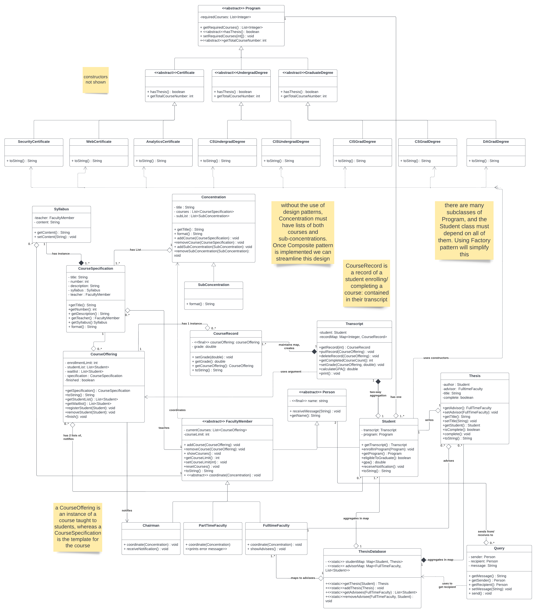

### Explanation
This class diagram represents a domain-level survey of the objects and behaviors required by the use-case, before it has been organized according to patterns and packages. Though all of the domain classes from the use-case are represented in this class diagram, the numerous dependencies throughout the application create a disorganized and chaotic class model. This visually demonstrates how the application will benefit from applying design patterns and partitioning classes into packages. A few fitting applications for design patterns immediately suggest themselves, and six of them are described below. Please note that within the design pattern class diagrams below, only the classes relevant to the pattern are included. Dependencies on classes external to the design pattern are not shown.

## Creational Pattern 1: Factory Pattern

### Diagram

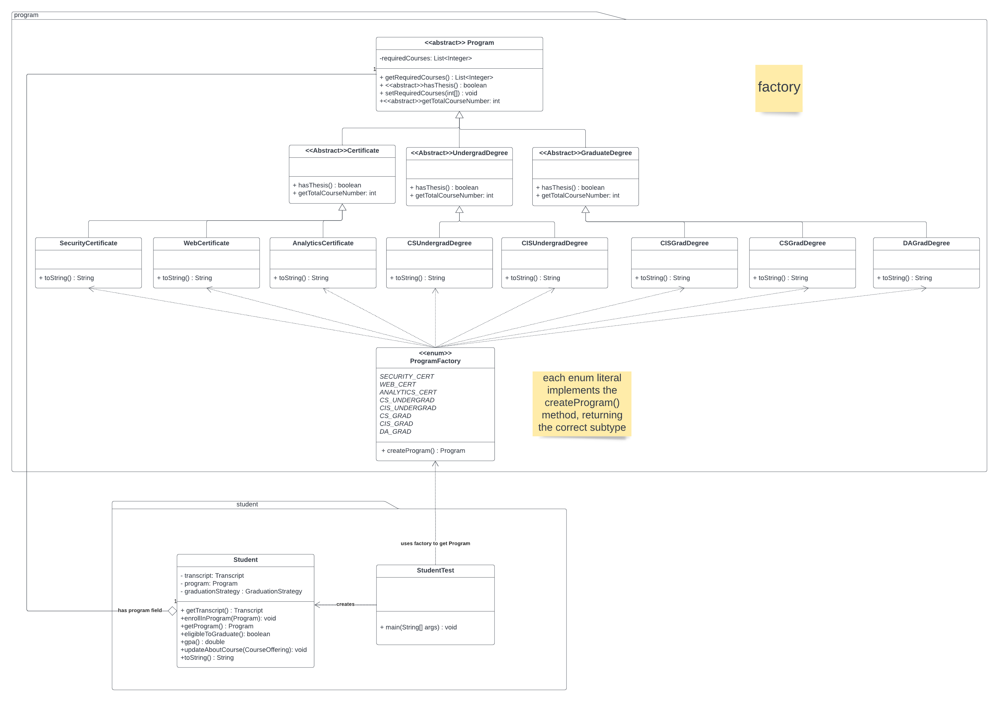

### Explanation

To reduce dependency on the many Program subclasses, I created one Factory class (program.ProgramFactory) which uses the constructors of the many Program subclasses and returns the appropriate subtype to the methods that use it, such as Student’s enrollInProgram() method. This reduces coupling between the packages and allows a Student object to maintain a reference to its Program without needing to keep track of the specific subclass, since the Program interface contains all needed behavior. Comparing this diagram to the diagram without patterns visually demonstrates the reduced dependencies. I also made the factory class an enum, where each enum literal implements the createProgram() method to return a Program (which is actually an instance of a degree or certificate program subclass). Thus, from the "students" package, a student can enroll in a program using an expression such as the following:

Program p = ProgramFactory.SECURITY_CERT.createProgram();

myStudent.enrollInProgram(p);

Using an enum class makes the factory less error-prone as compared to a String parameter, and it also eliminates the need to instantiate new factories each time a program is needed. This design pattern implementation accomplishes many of the same goals as Facade pattern, but this is a Factory because new instances are returned.

To demonstrate the use of this pattern, the student.StudentTest class enrolls Students in their respective programs using the following syntax:

Student alice = new Student("Alice");

// use Factory to create Alice's certificate program

alice.enrollInProgram(ProgramFactory.WEB_CERT.createProgram());

Student bob = new Student("Bob");

// use Factory to create Bob's degree program

bob.enrollInProgram(ProgramFactory.CS_GRAD.createProgram());

The relevant output for this test class is shown below.

### Output: StudentTest.java

(see Strategy pattern below for the rest of the output for this test class)

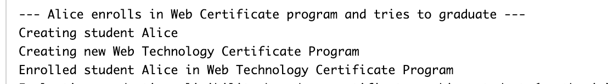
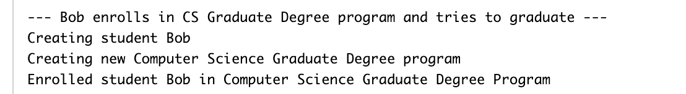

## Creational Pattern 2: Singleton

### Diagram

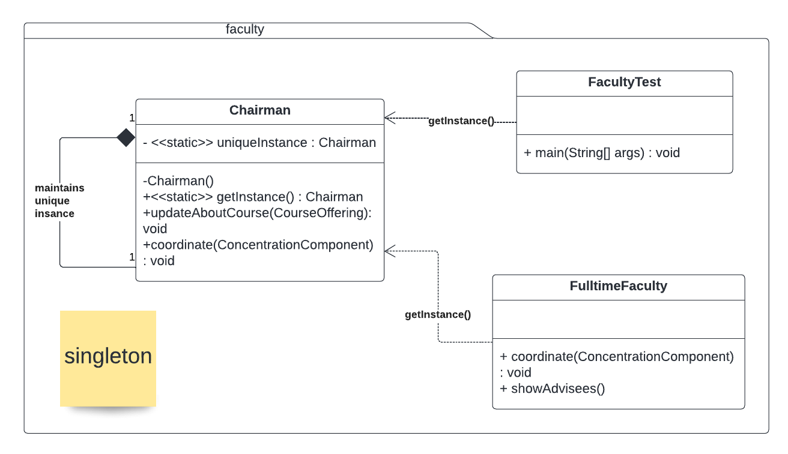

### Explanation

The use-case specifies that there is only one Chairman, so implementing the Singleton pattern in this class supports the design goal of correctness. Since the Chairman class extends the FacultyMember abstract class, using the Singleton pattern here allows Chairman to take advantage of polymorphism, so that we can use the Chairman instance as a type of FacultyMember and pass the Chairman object as a parameter if needed, including to methods that take a FacultyMember parameter.

To take advantage of the Singleton pattern, the Chairman class maintains a private static instance variable of its own type ("private static Chairman uniqueInstance") and keeps its constructor private. Instead of using the constructor to get a Chairman, external classes like FacultyTest use the Chairman getInstance() method, which will instantiate a new Chairman if none has been created yet and save it to its own static instance variable. That static instance will be returned from the method. This way, only one Chairman instance will ever be used throughout the application.

To demonstrate this pattern, the faculty.FacultyTest class creates two separate Chairman objects and calls Chairman.getInstance() to instantiate them. The two objects are then tested for strict equality using “chairman1 == chairman2”. The output below shows that although two separate method calls were used to instantiate two separate variables, the objects returned are equal.

### Output: FacultyTest.java

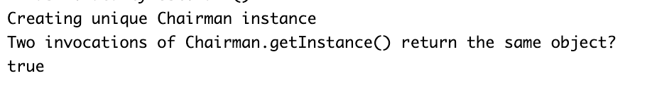

## Behavioral Pattern 1: Strategy

### Diagram

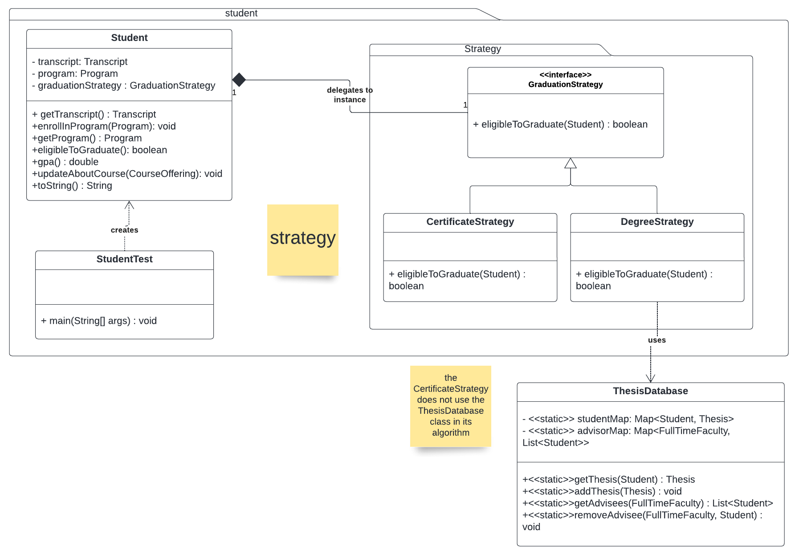

### Explanation

The algorithm for determining a student's eligibility to graduate will depend on which program they're enrolled in. Specifically, certificate-seeking students (that is, all students whose program instance is a subclass of Certificate) will only need to complete the courses required by their program, whereas degree-seeking students (students whose program instance is a subclass of Undergrad or GradDegree) will need to complete all core courses, sufficient electives, and also complete a thesis. Using strategy pattern, we can encapsulate the algorithms in their own classes (which are both subclasses of GraduationStrategy interface) and ensure that the correct strategy is set on the Student object when the student enrolls in a program using enrollInProgram() method. Then, when determining graduation eligibility on a Student object, the Student will internally delegate that action to its Strategy instance, which may be either a CertificateStrategy or a DegreeStrategy.

Within the CertificateStrategy class, the eligibleToGraduate() method ensures the Student is enrolled in a Program, then compares the student’s Transcript to their Program to ensure all four core courses required for that specific Certificate have been completed. If so, the student may graduate and true is returned.

Within the DegreeStrategy class, the eligibleToGraduate() method requires a more sophisticated algorithm with more checks on the student’s progress. First the method ensures the student is enrolled in a program, then determines whether they have completed the total number of courses required for the degree, including electives. If this requirement is met, the method then checks each core course required by that program against the CourseRecords in their Transcript. Assuming all core courses and sufficient electives are completed, the method finally checks the ThesisDatabase to see if this student's thesis both exists and has been completed. If all these requirements are met, the student is eligible to graduate and true is returned.

The output for this pattern is demonstrated by the student.StudentTest class. The output is quite extensive, because students in two programs are enrolled and tested for graduation eligibility. The comments throughout the output (below) are self-explanatory.

### Output: StudentTest.java

Note: some portions of repetitive output have been truncated in this report because there is too much console output to fit on screen. Please run StudentTest.java to see complete, unabridged output.

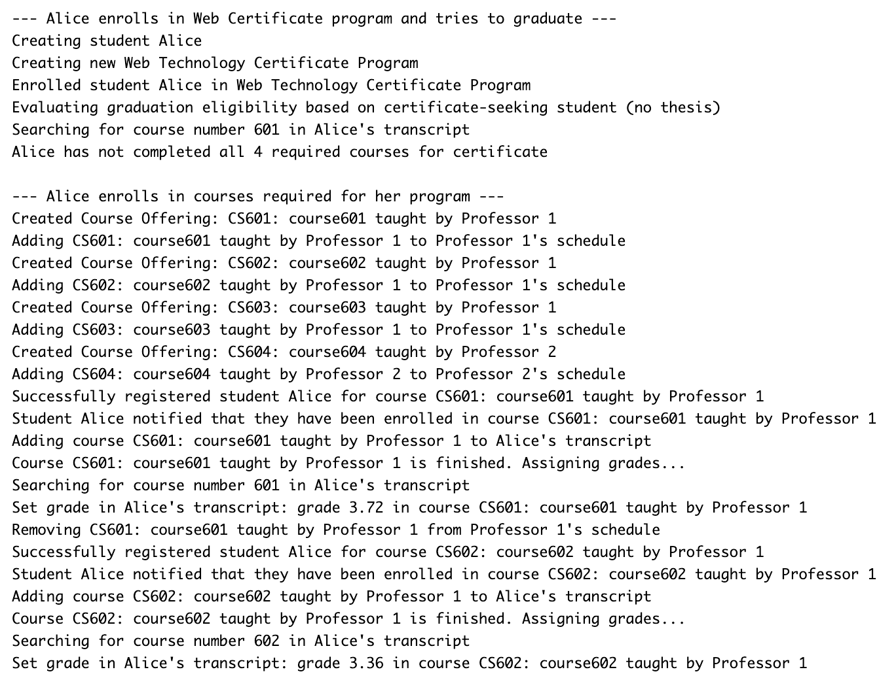
(truncated)
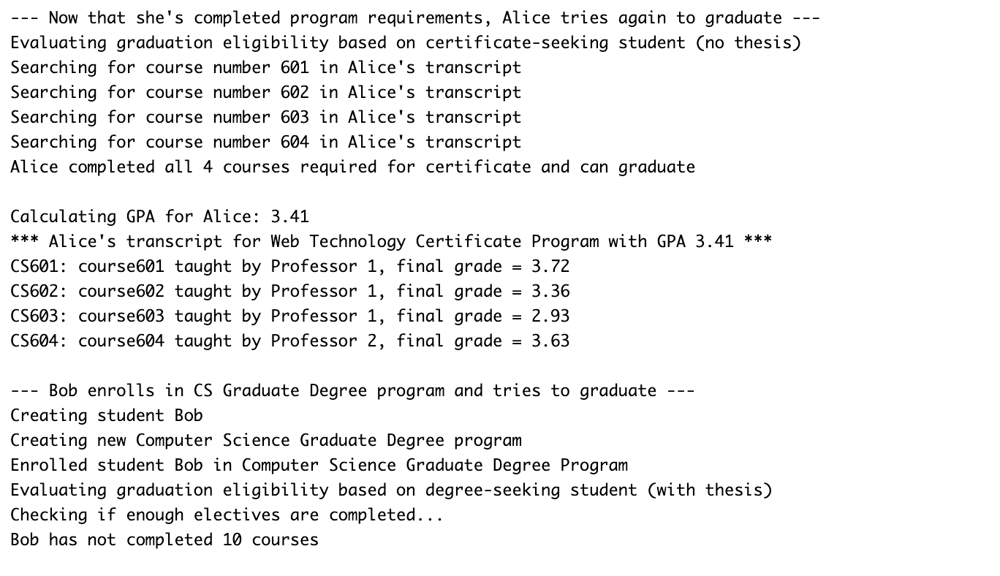
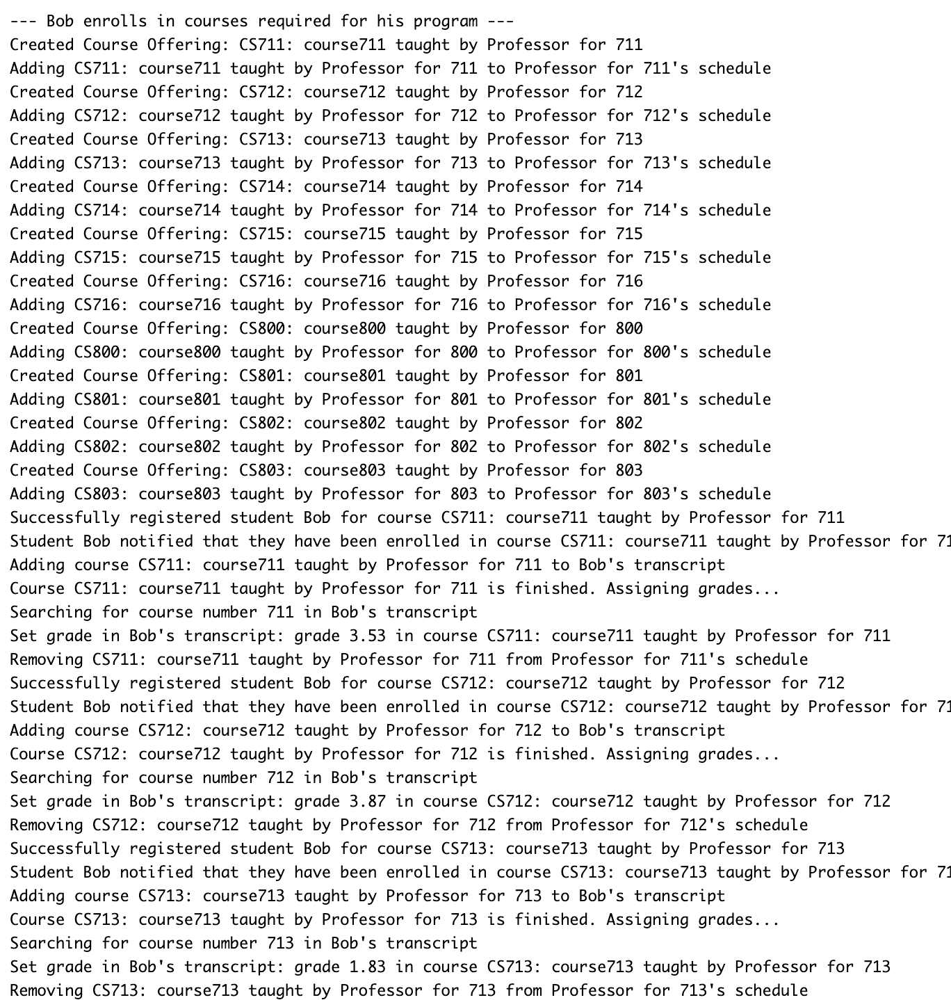
(truncated)
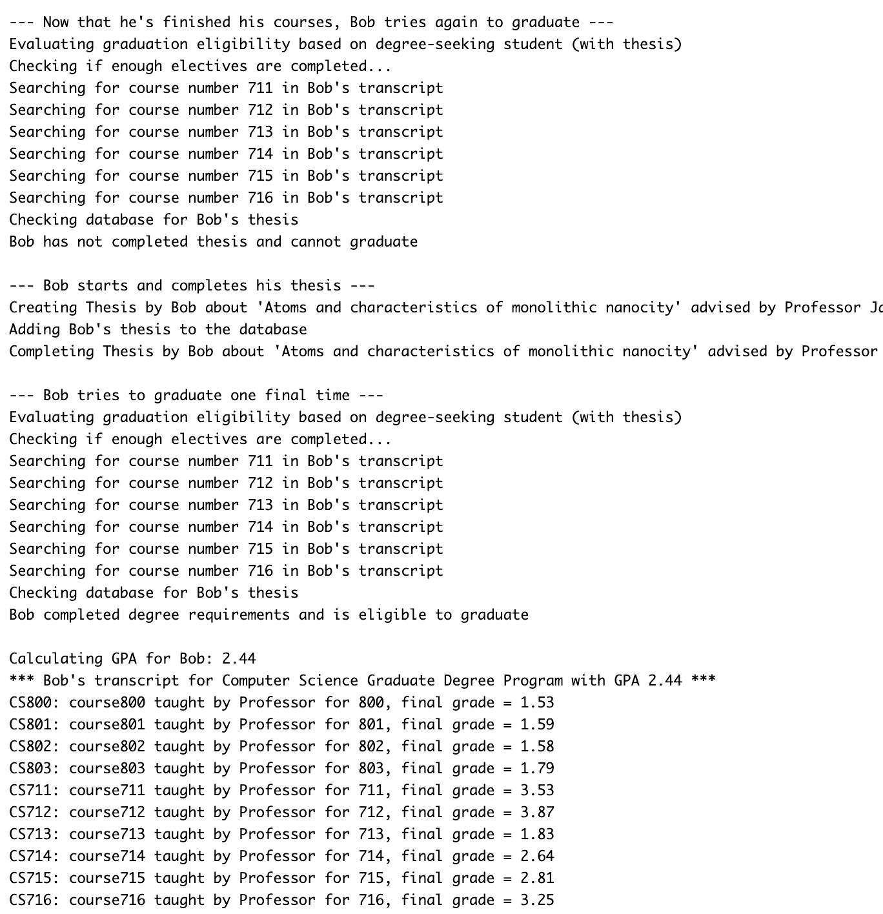

## Behavioral Pattern 2: Observer

### Diagram

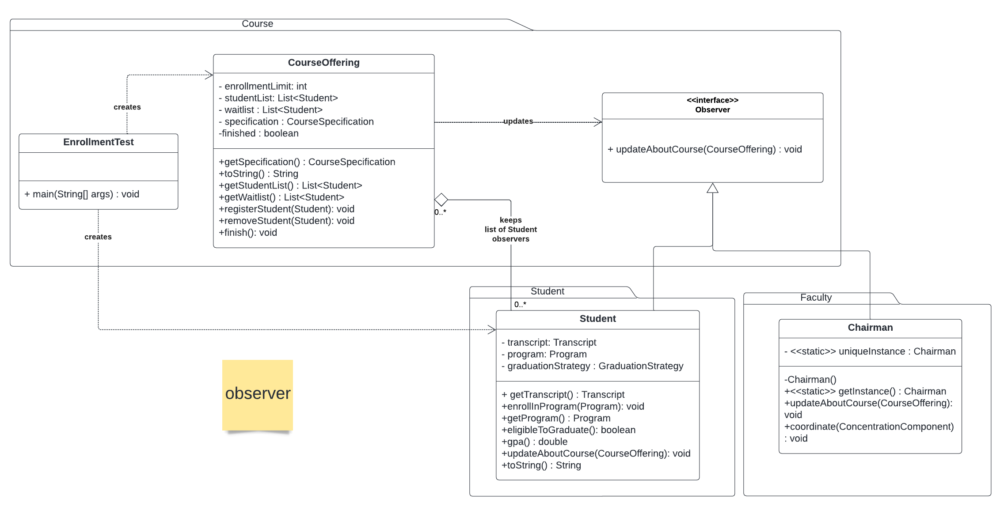

### Explanation

In the Observer pattern, a single source object aggregates a set of others, calling a method to notify members when the source's state changes. The course enrollment waitlist functionality, in which certain students and the Chairman need to be notified about changes to the enrollment list and waitlist for a course, is a perfect application for this pattern. The CourseOffering class (an instance of a given course taught during a semester) is the source (or subject), and the Chairman and Student classes are observers. To allow both classes to have a unified method that's triggered appropriately, both Chairman and Student implement the Observer interface, which defines one method, updateAboutCourse(CourseOffering).

When the enrollment limit is reached and students are added to the waitlist, updateAboutCourse() is invoked on the Chairman from within the CourseOffering's registerStudent() method. The Chairman uses the CourseOffering object’s methods to print a statement about the course's waitlist. Likewise, when a student drops the course, updateAboutCourse() is invoked on the first waitlisted student to inform them they've been enrolled. That waitlisted student is automatically moved from the waitlist to the enrollment list (using registerStudent() method) and their transcript is updated.

This Observer pattern differs in a few ways from the headfirst.simpleobserver example:
* The CourseOffering class does not explicitly implement a Subject or Source interface, as this would be an extra unnecessary class. Instead, it exemplifies the “subject” behavior through its own methods.
* The CourseOffering maintains lists of Students, not lists of Observers. It must aggregate Student objects rather than Observer superclass types because the CourseOffering uses other methods on the Students that aren’t available in Observer superclass, such as getTranscript(). And since the Chairman is a Singleton, CourseOffering doesn't need to keep a reference to it.
* The Student and Chairman classes don’t aggregate the CourseOffering subject because they don’t have any need for it. Instead, they receive the update about the waitlist through updateAboutCourse(CourseOffering) method, which is invoked on them from within CourseOffering’s registerStudent(Student) and removeStudent(Student) methods.

The course.EnrollmentTest class demonstrates this pattern and behavior. 

### Output: EnrollmentTest.java

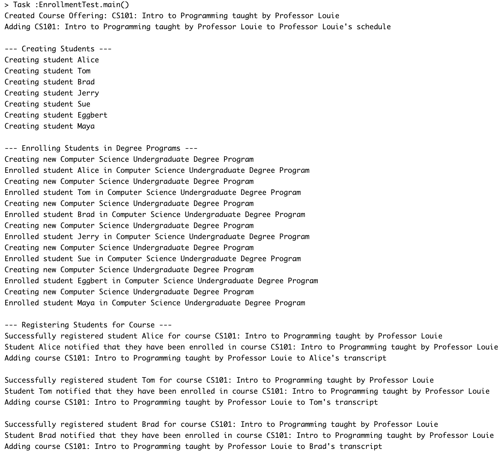
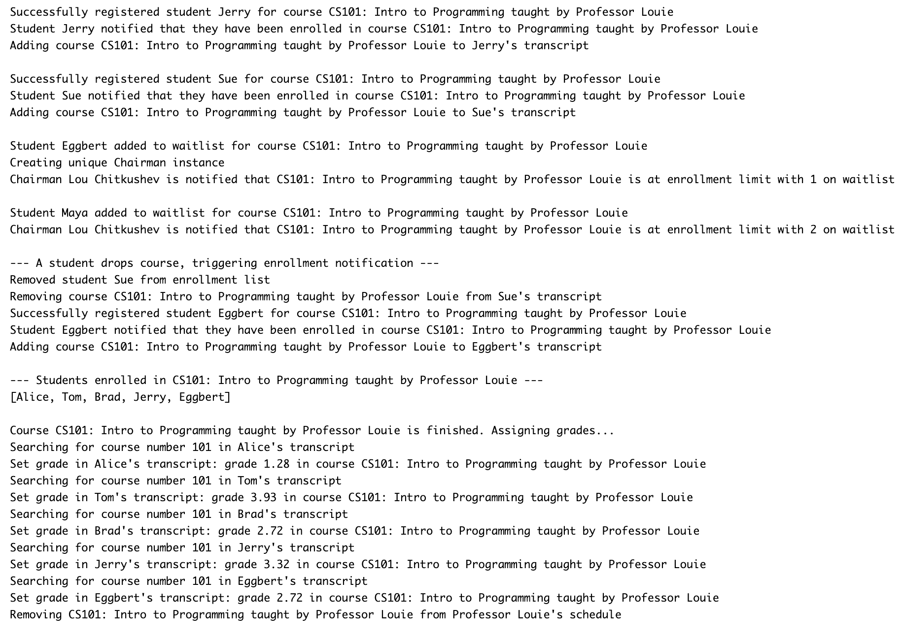

The rest of the output for EnrollmentTest.java demonstrates requirements from the use-case involving calculating student GPAs and transcripts, which is important but not relevant to this pattern.

## Structural Pattern 1: Composite

### Diagram

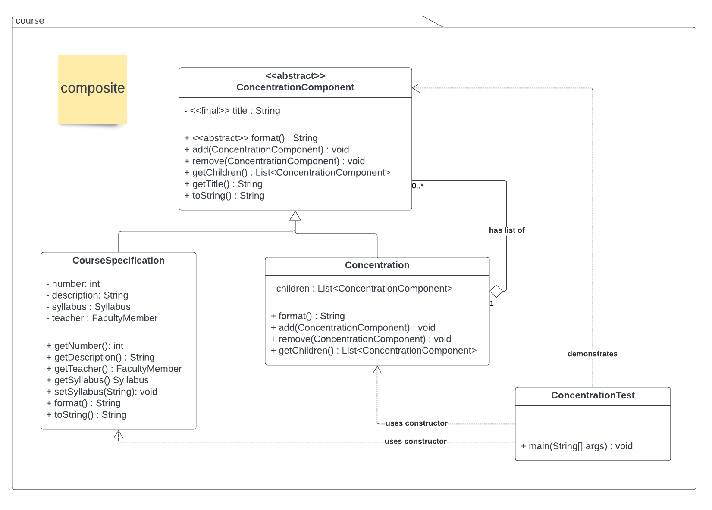

### Explanation

The use-case specifies that the courses are grouped under various concentrations, and that the concentration will have a collection of courses or may have sub-concentrations. This hierarchical structure is a fitting application for the Composite Pattern. In the original diagram, the "SubConcentration" class was distinct from the Concentration class. Using Composite Pattern, we can instead utilize an abstract CompositeComponent class that defines the methods add(ConcentrationComponent) and remove(ConcentrationComponent). The format() method remains abstract in this class and will be properly implemented by subclasses CourseSpecification and Concentration.

The Concentration concrete subclass overrides add(ConcentrationComponent) and remove(ConcentrationComponent) (which throw UnsupportedOperationException in the ConcentrationComponent parent) to add and remove components from a list of child components that the Concentration maintains. Because of the composite pattern, those child components may themselves be Concentrations (if sub-concentrations exist) or CourseSpecifications (if this is a small concentration with no sub-concentrations). The magic of the composite pattern happens within the format() method: the method returns a "format output" (String representation) of this object and recursively calls format() on all of its children in the list. This object does not need to know whether those children are sub-concentrations or courses.

The CourseSpecification class represents the template for a course, including its course number, title, and description. (In contrast, the CourseOffering class, which is not involved in this pattern, represents an actual instance of a course in which students can enroll.) CourseSpecification is a "leaf" node in the hierarchy, so it doesn't override add() and remove() or maintain a collection of child components. Its format() method returns a String description of the course and invokes no other methods internally.

To demonstrate this pattern, the course.ConcentrationTest class creates a top-level concentration, "Programming Languages," a sub-concentration "Object-Oriented Languages," and instantiates three courses. It adds these courses to the sub-concentration and adds that concentration to the top-level concentration. By calling format() on the top-level Programming Languages concentration, we see that the correct format output is printed for the whole tree, including the sub-concentration and the courses.

### Output: ConcentrationTest.java

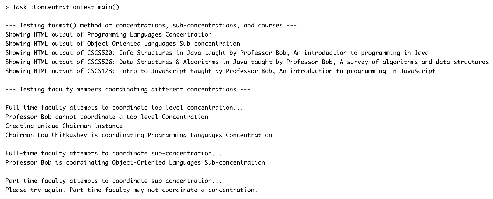

## Structural Pattern 2: Façade

### Diagram

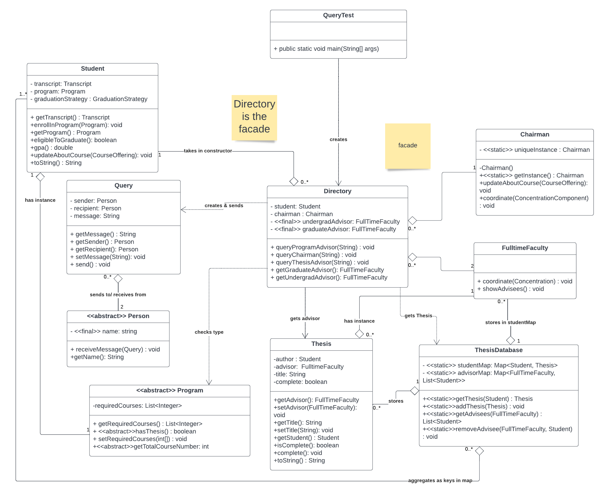

### Explanation

In this pattern, the Directory class provides a unified subsystem for a student to send queries to the chairman, thesis advisor, or advisor for their graduate or undergraduate program. Although a student can also send a query directly, this requires them to access several classes across multiple packages and to know in advance which FullTimeFaculty member the query should be sent to. The Directory encapsulates the functionality of retrieving the proper advisor for a particular student's program or thesis (or the Chairman), creating a new query object, setting its message, and sending it to the recipient. The QueryTest class can simply invoke queryProgramAdvisor(), queryThesisAdvisor(), or queryChairman(), using only the Directory class as a front-facing interface for the complex subsystem needed to create and send the desired query.

The ease of using the façade object is demonstrated in QueryTest class. In Part 1 (not using the façade), many steps are required: the student's Thesis must be retrieved from the ThesisDatabase to know who the advisor recipient of their Query will be, a query object must be created, a message must be attached to that object, and send() must be invoked on the Query. In Part 2, the same behavior is demonstrated in just one line of code, invoking queryThesisAdvisor() on a Directory object. Likewise, Part 3 demonstrates sending a query to a student's program advisor without the façade: figuring out the student's enrolled program, retrieving the appropriate advisor for that program, creating a new Query, supplying its content, and sending. Part 4 again demonstrates the benefit of the façade pattern: all this can be done in just one line of code, invoking queryProgramAdvisor() on the directory.

### Output: QueryTest.java

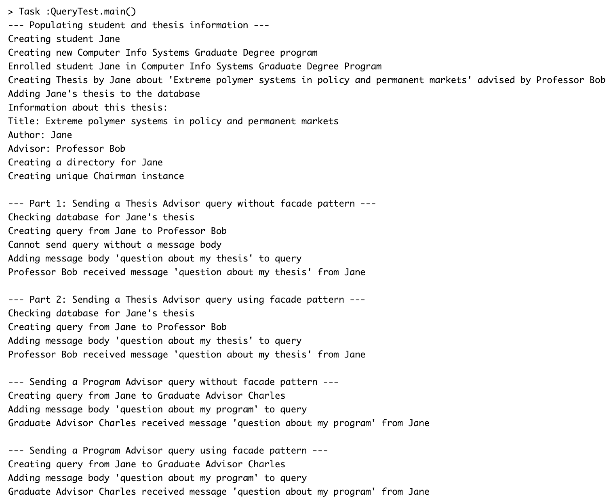

## Other Requirements

Code comments throughout the project, as well as additional output from the five test classes not captured here, demonstrates and describes other requirements from the use-case that are not relevant to these six design patterns.
